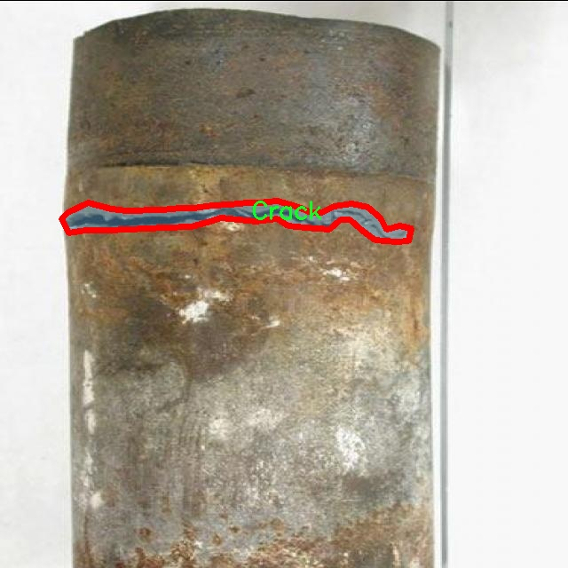

# 焊接缺陷分割系统源码＆数据集分享
 [yolov8-seg-RevCol＆yolov8-seg-goldyolo等50+全套改进创新点发刊_一键训练教程_Web前端展示]

### 1.研究背景与意义

项目参考[ILSVRC ImageNet Large Scale Visual Recognition Challenge](https://gitee.com/YOLOv8_YOLOv11_Segmentation_Studio/projects)

项目来源[AAAI Global Al lnnovation Contest](https://kdocs.cn/l/cszuIiCKVNis)

研究背景与意义

焊接作为现代制造业中不可或缺的连接工艺，其质量直接影响到产品的安全性和可靠性。随着工业自动化和智能化的不断发展，焊接缺陷的检测与识别已成为提升焊接质量的重要环节。传统的焊接缺陷检测方法多依赖人工目视检查和简单的图像处理技术，这不仅效率低下，而且容易受到人为因素的影响，导致漏检和误检的情况。因此，亟需一种高效、准确的焊接缺陷检测系统，以提高焊接质量的监控能力。

近年来，深度学习技术的迅猛发展为图像处理领域带来了革命性的变化，尤其是在目标检测和分割任务中表现出色。YOLO（You Only Look Once）系列模型因其快速和高效的特性，广泛应用于实时目标检测任务。YOLOv8作为该系列的最新版本，结合了更先进的网络结构和训练策略，能够在复杂环境中实现高精度的目标检测。然而，针对焊接缺陷的具体应用，YOLOv8仍存在一些不足之处，例如对小目标的检测能力不足、对不同焊接缺陷的区分度不够等。因此，基于改进YOLOv8的焊接缺陷分割系统的研究具有重要的现实意义。

本研究基于GoodWelding数据集，构建了一个包含1100幅图像的焊接缺陷实例分割模型。该数据集涵盖了六类焊接缺陷，包括“Bad Welding”、“Crack”、“Excess Reinforcement”、“Good Welding”、“Porosity”和“Spatters”。通过对这些焊接缺陷的分类与分割，不仅可以提高缺陷检测的准确性，还能为后续的焊接工艺改进提供数据支持。尤其是在工业4.0背景下，智能制造对焊接质量的要求日益提高，开发一套高效的焊接缺陷分割系统将为企业降低生产成本、提高产品质量提供有力保障。

此外，改进YOLOv8的焊接缺陷分割系统的研究还具有重要的学术价值。通过对现有模型的改进与优化，可以为深度学习在工业应用中的推广提供新的思路和方法。特别是在实例分割领域，如何在保证检测速度的同时提高分割精度，是当前研究的热点问题之一。本研究将通过引入多尺度特征融合、注意力机制等技术，探索YOLOv8在焊接缺陷检测中的应用潜力，推动相关领域的研究进展。

综上所述，基于改进YOLOv8的焊接缺陷分割系统的研究，不仅具有重要的应用价值，还将为深度学习技术在焊接领域的深入应用提供新的视角和方法。通过本研究的实施，期望能够实现焊接缺陷的高效检测与精确分割，为提升焊接质量、保障产品安全做出积极贡献。

### 2.图片演示


##### 注意：由于此博客编辑较早，上面“2.图片演示”和“3.视频演示”展示的系统图片或者视频可能为老版本，新版本在老版本的基础上升级如下：（实际效果以升级的新版本为准）

  （1）适配了YOLOV8的“目标检测”模型和“实例分割”模型，通过加载相应的权重（.pt）文件即可自适应加载模型。

  （2）支持“图片识别”、“视频识别”、“摄像头实时识别”三种识别模式。

  （3）支持“图片识别”、“视频识别”、“摄像头实时识别”三种识别结果保存导出，解决手动导出（容易卡顿出现爆内存）存在的问题，识别完自动保存结果并导出到tempDir中。

  （4）支持Web前端系统中的标题、背景图等自定义修改，后面提供修改教程。

  另外本项目提供训练的数据集和训练教程,暂不提供权重文件（best.pt）,需要您按照教程进行训练后实现图片演示和Web前端界面演示的效果。

### 3.视频演示

[3.1 视频演示](https://www.bilibili.com/video/BV1Wo2iYeEmX/)

### 4.数据集信息展示

##### 4.1 本项目数据集详细数据（类别数＆类别名）

nc: 6
names: ['Bad Welding', 'Crack', 'Excess Reinforcement', 'Good Welding', 'Porosity', 'Spatters']


##### 4.2 本项目数据集信息介绍

数据集信息展示

在焊接缺陷检测领域，准确的缺陷分割是提升焊接质量和确保结构安全的关键。为此，我们构建了一个名为“GoodWelding”的数据集，旨在为改进YOLOv8-seg模型提供丰富的训练素材，以实现高效的焊接缺陷分割。该数据集包含六个主要类别，涵盖了焊接过程中可能出现的各种缺陷，具体类别包括“Bad Welding”、“Crack”、“Excess Reinforcement”、“Good Welding”、“Porosity”和“Spatters”。这些类别的选择不仅反映了焊接工艺中常见的问题，还为模型的训练提供了多样化的样本，使其能够在实际应用中更好地识别和分割不同类型的焊接缺陷。

“GoodWelding”数据集的构建过程注重数据的多样性和代表性。每个类别都包含大量的图像样本，这些样本来自于不同的焊接工艺、材料和环境条件。通过这种方式，我们确保了数据集的广泛适用性，使得训练出的模型能够在各种实际场景中表现出色。例如，“Bad Welding”类别包含了焊接接头不良、焊缝缺失等情况的图像，而“Crack”类别则专注于焊接接头中的裂纹特征。与此同时，“Excess Reinforcement”类别则提供了焊接过程中多余的焊料现象的实例，帮助模型识别焊接过度的情况。

在数据集的标注过程中，我们采用了专业的焊接工程师进行人工标注，确保每个图像的缺陷类型和位置都得到了准确的识别。这种高质量的标注为模型的训练提供了坚实的基础，使得YOLOv8-seg能够学习到更为细致的特征，从而在实际应用中实现更高的分割精度。此外，数据集中的“Good Welding”类别则为模型提供了正样本，帮助其在进行缺陷检测时能够更好地区分正常焊接与缺陷焊接之间的差异。

为了进一步增强模型的鲁棒性，我们在数据集中引入了数据增强技术，包括旋转、缩放、翻转和颜色调整等。这些技术不仅增加了数据集的样本数量，还使得模型在面对不同光照、角度和背景时，能够保持良好的识别能力。这种多样化的训练数据有助于提高模型的泛化能力，使其在真实环境中能够适应各种复杂情况。

总之，“GoodWelding”数据集为焊接缺陷分割系统的训练提供了全面而丰富的素材，涵盖了多种焊接缺陷类型，并通过专业标注和数据增强技术确保了数据的高质量和多样性。通过对该数据集的深入挖掘和应用，我们期待能够推动焊接缺陷检测技术的发展，为焊接行业的质量控制提供更为精准和高效的解决方案。




### 5.全套项目环境部署视频教程（零基础手把手教学）

[5.1 环境部署教程链接（零基础手把手教学）](https://www.bilibili.com/video/BV1jG4Ve4E9t/?vd_source=bc9aec86d164b67a7004b996143742dc)


[5.2 安装Python虚拟环境创建和依赖库安装视频教程链接（零基础手把手教学）](https://www.bilibili.com/video/BV1nA4VeYEze/?vd_source=bc9aec86d164b67a7004b996143742dc)

### 6.手把手YOLOV8-seg训练视频教程（零基础小白有手就能学会）

[6.1 手把手YOLOV8-seg训练视频教程（零基础小白有手就能学会）](https://www.bilibili.com/video/BV1cA4VeYETe/?vd_source=bc9aec86d164b67a7004b996143742dc)


按照上面的训练视频教程链接加载项目提供的数据集，运行train.py即可开始训练



     Epoch   gpu_mem       box       obj       cls    labels  img_size
     1/200     0G   0.01576   0.01955  0.007536        22      1280: 100%|██████████| 849/849 [14:42<00:00,  1.04s/it]
               Class     Images     Labels          P          R     mAP@.5 mAP@.5:.95: 100%|██████████| 213/213 [01:14<00:00,  2.87it/s]
                 all       3395      17314      0.994      0.957      0.0957      0.0843

     Epoch   gpu_mem       box       obj       cls    labels  img_size
     2/200     0G   0.01578   0.01923  0.007006        22      1280: 100%|██████████| 849/849 [14:44<00:00,  1.04s/it]
               Class     Images     Labels          P          R     mAP@.5 mAP@.5:.95: 100%|██████████| 213/213 [01:12<00:00,  2.95it/s]
                 all       3395      17314      0.996      0.956      0.0957      0.0845

     Epoch   gpu_mem       box       obj       cls    labels  img_size
     3/200     0G   0.01561    0.0191  0.006895        27      1280: 100%|██████████| 849/849 [10:56<00:00,  1.29it/s]
               Class     Images     Labels          P          R     mAP@.5 mAP@.5:.95: 100%|███████   | 187/213 [00:52<00:00,  4.04it/s]
                 all       3395      17314      0.996      0.957      0.0957      0.0845


### 7.50+种全套YOLOV8-seg创新点代码加载调参视频教程（一键加载写好的改进模型的配置文件）

[7.1 50+种全套YOLOV8-seg创新点代码加载调参视频教程（一键加载写好的改进模型的配置文件）](https://www.bilibili.com/video/BV1Hw4VePEXv/?vd_source=bc9aec86d164b67a7004b996143742dc)

### 8.YOLOV8-seg图像分割算法原理

原始YOLOv8-seg算法原理

YOLOv8-seg算法是YOLO系列目标检测算法的最新进展，旨在通过引入分割功能，进一步提升目标检测的精度和应用范围。YOLO（You Only Look Once）系列算法自其诞生以来，便以其高效的实时目标检测能力而受到广泛关注。YOLOv8-seg在YOLOv8的基础上，结合了语义分割的特性，使得算法不仅能够识别目标的位置和类别，还能够精确地分割出目标的形状和边界。这一进步使得YOLOv8-seg在复杂场景下的表现更加出色，尤其是在需要对目标进行精细化处理的应用中，如自动驾驶、医学影像分析等领域。

YOLOv8-seg的核心原理依然基于YOLO系列的单阶段检测框架，采用回归的方法来解决目标检测问题。与传统的两阶段检测方法相比，YOLOv8-seg通过一个统一的神经网络模型，能够同时进行目标的定位、分类和分割，从而大幅提高了检测速度和效率。其网络结构由主干网络（backbone）、特征增强网络（neck）和检测头（head）三部分组成。主干网络依然采用了CSP（Cross Stage Partial）结构，以有效提取特征；特征增强网络则引入了PAN-FPN（Path Aggregation Network-Feature Pyramid Network）结构，以充分融合多尺度特征信息；而检测头部分则采用了解耦头（Decoupled Head），将分类和回归任务分开处理，进一步提升了模型的性能。

在数据预处理方面，YOLOv8-seg延续了YOLOv5的策略，采用多种数据增强技术，如马赛克增强、混合增强、空间扰动和颜色扰动等。这些技术不仅提高了模型的鲁棒性，还增强了模型对不同场景和光照条件的适应能力。通过这些预处理手段，YOLOv8-seg能够更好地学习到目标的特征，从而提高检测精度。

YOLOv8-seg的主干网络结构采用了改进的C2f模块，取代了YOLOv5中的C3模块。C2f模块通过引入更多的分支，丰富了梯度回传时的支流，增强了特征提取的能力。这一改进使得YOLOv8-seg在处理复杂场景时，能够更有效地捕捉到目标的细节特征。此外，YOLOv8-seg在特征增强网络中依然采用FPN-PAN结构，以实现多尺度信息的充分融合。FPN（Feature Pyramid Network）和PAN（Path Aggregation Network）的结合，使得模型能够在不同尺度上进行特征提取和融合，从而提升对小目标和大目标的检测能力。

在检测头的设计上，YOLOv8-seg采用了解耦头结构，这一结构的优势在于能够将分类和定位任务分开处理，使得模型在进行目标定位时，不会受到分类任务的干扰。具体而言，解耦头由两条并行的分支组成，一条负责提取类别特征，另一条负责提取位置特征。通过这种方式，YOLOv8-seg能够更专注于每个任务，从而提高整体的检测精度。

值得一提的是，YOLOv8-seg在标签分配策略上也进行了创新。传统的目标检测方法通常依赖于预定义的锚框，而YOLOv8-seg则采用了Anchor-free的目标检测方法，直接通过回归方式预测目标的位置和大小。这一方法不仅简化了模型的设计，还使得模型在处理不同尺度和形状的目标时，能够更加灵活和高效。此外，YOLOv8-seg引入了动态标签分配策略，能够根据实际情况动态调整正负样本的匹配，从而进一步提升模型的训练效果。

在损失函数的设计上，YOLOv8-seg采用了Varifocal Loss（VFL）和CIoU Loss（Complete Intersection over Union Loss）相结合的方式，以优化分类和回归的性能。VFL通过不对称参数对正负样本进行加权，使得模型能够更加关注高质量的正样本，从而提升整体的AP（Average Precision）指标。而CIoU Loss则在回归过程中考虑了目标的中心点、宽高比和重叠度等多个因素，使得模型在定位时更加精确。

综上所述，YOLOv8-seg算法通过引入分割功能，结合先进的网络结构和损失函数设计，显著提升了目标检测的精度和效率。其在实时性和准确性上的平衡，使得YOLOv8-seg在各种复杂应用场景中展现出强大的能力，成为目标检测领域的一项重要技术进展。随着YOLOv8-seg的不断发展和完善，未来有望在更多实际应用中发挥重要作用。


### 9.系统功能展示（检测对象为举例，实际内容以本项目数据集为准）

图9.1.系统支持检测结果表格显示

  图9.2.系统支持置信度和IOU阈值手动调节

  图9.3.系统支持自定义加载权重文件best.pt(需要你通过步骤5中训练获得)

  图9.4.系统支持摄像头实时识别

  图9.5.系统支持图片识别

  图9.6.系统支持视频识别

  图9.7.系统支持识别结果文件自动保存

  图9.8.系统支持Excel导出检测结果数据


### 10.50+种全套YOLOV8-seg创新点原理讲解（非科班也可以轻松写刊发刊，V11版本正在科研待更新）

#### 10.1 由于篇幅限制，每个创新点的具体原理讲解就不一一展开，具体见下列网址中的创新点对应子项目的技术原理博客网址【Blog】：


[10.1 50+种全套YOLOV8-seg创新点原理讲解链接](https://gitee.com/qunmasj/good)

#### 10.2 部分改进模块原理讲解(完整的改进原理见上图和技术博客链接)【如果此小节的图加载失败可以通过CSDN或者Github搜索该博客的标题访问原始博客，原始博客图片显示正常】
### YOLOv8简介
#### Yolov8网络模型
Yolov8n的网络分为输入端、主干网( Back-bone) 、Neck模块和输出端4个部分（图4)。输
人端主要有马赛克( Mosaic）数据增强、自适应锚框计算和自适应灰度填充。主干网有Conv、C2和SPPF结构，其中，C2r模块是对残差特征进行学习的主要模块，该模块仿照Yolov7的ELAN结构,通过更多的分支跨层连接，丰富了模型的梯度流，可形成一个具有更强特征表示能力的神经网络模
块。Neck模块采用PAN ( path aggregation nelwOrk ,结构，可加强网络对不同缩放尺度对象特征融合的
能力。输出端将分类和检测过程进行解耦，主要包括损失计算和目标检测框筛选，其中，损失计算过程主要包括正负样本分配策略和 Loss计算，Yolov8n 网络主要使用TaskAlignedAssignerl 10]方法，即根据分类与回归的分数加权结果选择正样本;Loss计算包括分类和回归2个分支，无Ob-jecIness分支。分类分支依然采用BCE Loss，回归分支则使用了Distribution Focal Loss!11〕和CIOU( complele inlersection over union)损失函数。

### 可扩张残差（DWR）注意力模块
当前的许多工作直接采用多速率深度扩张卷积从一个输入特征图中同时捕获多尺度上下文信息，从而提高实时语义分割的特征提取效率。 然而，这种设计可能会因为结构和超参数的不合理而导致多尺度上下文信息的访问困难。 为了降低绘制多尺度上下文信息的难度，我们提出了一种高效的多尺度特征提取方法，该方法分解了原始的单步特征提取方法方法分为两个步骤，区域残差-语义残差。 在该方法中，多速率深度扩张卷积在特征提取中发挥更简单的作用：根据第一步提供的每个简明区域形式特征图，在第二步中使用一个所需的感受野执行简单的基于语义的形态过滤 一步，提高他们的效率。 此外，扩张率和扩张卷积的容量每个网络阶段都经过精心设计，以充分利用所有可以实现的区域形式的特征图。 因此，我们分别为高层和低层网络设计了一种新颖的扩张式残差（DWR）模块和简单倒置残差（SIR）模块。


首先，该博客引入了一个Dilation-wise Residual（DWR）模块，用于提取网络高层的特征，如图2a所示。多分支结构用于扩展感受野，其中每个分支采用不同空洞率的空洞深度卷积。
然后，专门设计了一个Simple Inverted Residual（SIR）模块来提取网络低层的特征，如图2b所示。该模块仅具有3×3的微小感受野，但使用inverted bottleneck式结构来扩展通道数量，确保更强的特征提取能力。
最后，基于DWR和SIR模块，构建了一个编码器-解码器风格的网络DWRSeg，其中解码器采用了简单的类似FCN的结构。解码器使用来自最后两个阶段的强语义信息直接对特征图进行上采样，然后将它们与来自较低阶段的特征图（包含丰富的详细信息）拼接起来，以进行最终预测。


### 11.项目核心源码讲解（再也不用担心看不懂代码逻辑）

#### 11.1 ultralytics\nn\extra_modules\ops_dcnv3\test.py

以下是经过简化和注释的核心代码部分，保留了主要功能并对每个部分进行了详细的中文注释：

```python
# --------------------------------------------------------
# InternImage
# Copyright (c) 2022 OpenGVLab
# Licensed under The MIT License [see LICENSE for details]
# --------------------------------------------------------

import time
import torch
from functions.dcnv3_func import DCNv3Function, dcnv3_core_pytorch

# 输入和输出的尺寸参数
H_in, W_in = 8, 8  # 输入图像的高度和宽度
N, M, D = 2, 4, 16  # 批量大小N，输出通道数M，输入通道数D
Kh, Kw = 3, 3  # 卷积核的高度和宽度
remove_center = False  # 是否移除中心点
P = Kh * Kw - remove_center  # 卷积核的有效点数
offset_scale = 2.0  # 偏移量的缩放因子
pad = 1  # 填充大小
dilation = 1  # 膨胀率
stride = 1  # 步幅

# 计算输出的高度和宽度
H_out = (H_in + 2 * pad - (dilation * (Kh - 1) + 1)) // stride + 1
W_out = (W_in + 2 * pad - (dilation * (Kw - 1) + 1)) // stride + 1

torch.manual_seed(3)  # 设置随机种子以确保可重复性

@torch.no_grad()
def check_forward_equal_with_pytorch_float():
    # 生成随机输入、偏移量和掩码
    input = torch.rand(N, H_in, W_in, M * D).cuda() * 0.01
    offset = torch.rand(N, H_out, W_out, M * P * 2).cuda() * 10
    mask = torch.rand(N, H_out, W_out, M, P).cuda() + 1e-5
    mask /= mask.sum(-1, keepdim=True)  # 归一化掩码
    mask = mask.reshape(N, H_out, W_out, M * P)

    # 使用PyTorch的核心函数计算输出
    output_pytorch = dcnv3_core_pytorch(
        input,
        offset,
        mask,
        Kh, Kw, stride, stride, Kh // 2, Kw // 2, dilation, dilation, M, D, offset_scale, remove_center
    ).detach().cpu()

    # 使用自定义的DCNv3函数计算输出
    output_cuda = DCNv3Function.apply(
        input,
        offset,
        mask,
        Kh, Kw, stride, stride, Kh // 2, Kw // 2, dilation, dilation, M, D, offset_scale,
        im2col_step=2, remove_center
    ).detach().cpu()

    # 检查两个输出是否相近
    fwdok = torch.allclose(output_cuda, output_pytorch, rtol=1e-2, atol=1e-3)
    max_abs_err = (output_cuda - output_pytorch).abs().max()  # 最大绝对误差
    max_rel_err = ((output_cuda - output_pytorch).abs() / output_pytorch.abs()).max()  # 最大相对误差
    print('>>> forward float')
    print(f'* {fwdok} check_forward_equal_with_pytorch_float: max_abs_err {max_abs_err:.2e} max_rel_err {max_rel_err:.2e}')

if __name__ == '__main__':
    check_forward_equal_with_pytorch_float()  # 调用前向一致性检查函数
```

### 代码说明：
1. **导入库**：导入必要的库，包括`torch`和自定义的DCNv3函数。
2. **参数设置**：定义输入输出的尺寸、卷积核的大小、填充、步幅等参数。
3. **输出尺寸计算**：根据输入尺寸和卷积参数计算输出的高度和宽度。
4. **前向一致性检查**：`check_forward_equal_with_pytorch_float`函数生成随机输入、偏移量和掩码，并分别使用PyTorch的核心函数和自定义的DCNv3函数计算输出，最后比较两个输出的相似性。
5. **主程序**：在主程序中调用前向一致性检查函数。

以上是核心代码部分，去掉了不必要的函数和复杂的检查逻辑，以便于理解和使用。

这个文件是一个用于测试和验证DCNv3（Deformable Convolutional Networks v3）功能的Python脚本，主要依赖于PyTorch库。代码中包含了多个函数，用于检查DCNv3的前向和反向传播是否与PyTorch的实现一致，并且还测量了计算时间。

首先，代码引入了一些必要的库，包括`torch`和`torch.nn`，并设置了一些超参数，如输入和输出的高度和宽度、卷积核的大小、填充、步幅等。这些参数在后续的测试中会被用到。

接下来，定义了几个主要的测试函数。`check_forward_equal_with_pytorch_double`和`check_forward_equal_with_pytorch_float`分别用于检查DCNv3在双精度和单精度下的前向传播输出是否与PyTorch的实现一致。它们生成随机输入、偏移量和掩码，然后调用自定义的`dcnv3_core_pytorch`函数和`DCNv3Function.apply`来计算输出，并比较结果的相似性。

在前向传播的检查中，使用了`torch.allclose`来判断两个输出是否在给定的相对和绝对容差范围内相近，同时计算最大绝对误差和相对误差，并将结果打印出来。

接下来，`check_backward_equal_with_pytorch_double`和`check_backward_equal_with_pytorch_float`函数用于检查反向传播的梯度是否一致。它们的工作流程与前向传播的检查类似，但在计算输出后会调用`.backward()`方法来计算梯度，并比较输入、偏移量和掩码的梯度。

最后，`check_time_cost`函数用于测量DCNv3在不同`im2col_step`参数下的计算时间。它生成一个较大的输入张量，并多次调用DCNv3的前向传播函数，记录计算所需的时间。

在主程序部分，依次调用了前向和反向传播的检查函数，并对不同通道数的情况进行了测试。最后，测试了不同的`im2col_step`值以评估性能。

总体而言，这个脚本的主要目的是验证DCNv3的实现是否正确，并评估其性能，以确保在实际应用中能够有效运行。

#### 11.2 ultralytics\utils\benchmarks.py

以下是代码中最核心的部分，并附上详细的中文注释：

```python
import time
import pandas as pd
from ultralytics import YOLO
from ultralytics.utils import select_device, check_yolo

def benchmark(model='yolov8n.pt', imgsz=160, device='cpu', verbose=False):
    """
    基准测试YOLO模型在不同格式下的速度和准确性。

    参数:
        model (str): 模型文件的路径，默认为'yolov8n.pt'。
        imgsz (int): 基准测试使用的图像大小，默认为160。
        device (str): 运行基准测试的设备，可以是'cpu'或'cuda'，默认为'cpu'。
        verbose (bool): 如果为True，将输出详细的基准测试信息，默认为False。

    返回:
        df (pandas.DataFrame): 包含每种格式的基准测试结果的数据框，包括文件大小、指标和推理时间。
    """
    
    # 设置Pandas显示选项
    pd.options.display.max_columns = 10
    pd.options.display.width = 120
    
    # 选择设备
    device = select_device(device, verbose=False)
    
    # 加载模型
    model = YOLO(model)

    results = []  # 存储结果的列表
    start_time = time.time()  # 记录开始时间

    # 遍历不同的导出格式
    for i, (name, format, suffix, cpu, gpu) in export_formats().iterrows():
        emoji, filename = '❌', None  # 默认导出状态为失败
        try:
            # 检查导出格式的支持性
            if 'cpu' in device.type:
                assert cpu, 'CPU不支持此推理'
            if 'cuda' in device.type:
                assert gpu, 'GPU不支持此推理'

            # 导出模型
            if format == '-':
                filename = model.ckpt_path or model.cfg  # PyTorch格式
            else:
                filename = model.export(imgsz=imgsz, format=format, device=device, verbose=False)
                assert suffix in str(filename), '导出失败'
            emoji = '✅'  # 导出成功

            # 进行推理
            model.predict('bus.jpg', imgsz=imgsz, device=device)

            # 验证模型
            results_dict = model.val(data='coco8.yaml', batch=1, imgsz=imgsz, device=device)
            metric, speed = results_dict.results_dict['mAP'], results_dict.speed['inference']
            results.append([name, emoji, round(file_size(filename), 1), round(metric, 4), round(speed, 2)])
        except Exception as e:
            if verbose:
                assert type(e) is AssertionError, f'基准测试失败: {name}: {e}'
            results.append([name, emoji, None, None, None])  # 记录失败信息

    # 打印结果
    check_yolo(device=device)  # 打印系统信息
    df = pd.DataFrame(results, columns=['格式', '状态', '大小 (MB)', '指标', '推理时间 (ms/im)'])

    # 输出基准测试完成的信息
    duration = time.time() - start_time
    print(f'\n基准测试完成，耗时: {duration:.2f}s\n{df}\n')

    return df
```

### 代码说明：
1. **导入必要的库**：引入了时间、Pandas、YOLO模型和一些工具函数。
2. **benchmark函数**：该函数用于基准测试YOLO模型的速度和准确性。
   - **参数**：
     - `model`：指定要测试的模型文件路径。
     - `imgsz`：指定输入图像的大小。
     - `device`：指定运行基准测试的设备（CPU或GPU）。
     - `verbose`：控制是否输出详细信息。
   - **结果存储**：使用一个列表`results`来存储每种格式的测试结果。
   - **导出和推理**：遍历不同的导出格式，进行模型导出和推理，并记录结果。
   - **异常处理**：如果在导出或推理过程中发生错误，记录错误信息。
   - **结果输出**：将结果转换为Pandas DataFrame并打印。

通过这个简化的代码和注释，可以更清晰地理解YOLO模型基准测试的核心逻辑。

这个程序文件 `benchmarks.py` 是用于对 YOLO 模型进行性能基准测试的工具，主要评估模型在不同格式下的速度和准确性。文件中包含了两个主要的类和多个函数，分别用于基准测试和模型性能分析。

首先，文件开头的文档字符串简要介绍了如何使用该模块，包括如何导入和调用 `ProfileModels` 和 `benchmark` 函数。它列出了支持的模型格式以及相应的导出参数，涵盖了多种深度学习框架，如 PyTorch、ONNX、TensorRT 等。

`benchmark` 函数是该文件的核心功能之一，旨在对指定的 YOLO 模型进行基准测试。函数的参数包括模型路径、数据集、图像大小、是否使用半精度或整型精度、设备类型（CPU 或 GPU）以及是否输出详细信息。该函数返回一个包含各格式基准测试结果的 pandas DataFrame，结果包括文件大小、评估指标和推理时间。

在 `benchmark` 函数内部，首先通过 `select_device` 函数选择设备，然后根据输入的模型路径加载 YOLO 模型。接着，函数遍历所有支持的导出格式，尝试导出模型并进行推理和验证。对于每种格式，函数会记录推理的速度和准确性，并将结果存储在列表中。最后，函数会打印基准测试结果，并将其写入日志文件。

`ProfileModels` 类用于对不同模型进行性能分析，特别是 ONNX 和 TensorRT 格式的模型。该类的构造函数接受模型路径、定时运行次数、预热运行次数、最小运行时间、图像大小等参数。`profile` 方法负责执行性能分析，返回模型的速度和其他性能指标。

在 `ProfileModels` 类中，`get_files` 方法用于获取用户指定路径下的所有相关模型文件，`get_onnx_model_info` 方法用于提取 ONNX 模型的信息，`profile_tensorrt_model` 和 `profile_onnx_model` 方法则分别用于分析 TensorRT 和 ONNX 模型的性能。每个分析方法都会进行预热运行以提高准确性，并通过多次运行计算平均时间和标准差。

最后，`generate_table_row` 和 `generate_results_dict` 方法用于生成格式化的表格行和结果字典，以便于展示模型的性能指标。`print_table` 方法则负责将结果以表格形式打印到控制台。

整体而言，这个文件提供了一种系统化的方法来评估和比较不同格式的 YOLO 模型在速度和准确性方面的表现，对于开发者在选择和优化模型时具有重要的参考价值。

#### 11.3 ui.py

```python
import sys
import subprocess

def run_script(script_path):
    """
    使用当前 Python 环境运行指定的脚本。

    Args:
        script_path (str): 要运行的脚本路径

    Returns:
        None
    """
    # 获取当前 Python 解释器的路径
    python_path = sys.executable

    # 构建运行命令，使用 streamlit 运行指定的脚本
    command = f'"{python_path}" -m streamlit run "{script_path}"'

    # 执行命令并等待其完成
    result = subprocess.run(command, shell=True)
    
    # 检查命令执行结果，如果返回码不为0，表示出错
    if result.returncode != 0:
        print("脚本运行出错。")


# 主程序入口
if __name__ == "__main__":
    # 指定要运行的脚本路径
    script_path = "web.py"  # 这里可以直接指定脚本名

    # 调用函数运行脚本
    run_script(script_path)
```

### 代码核心部分及注释说明：

1. **导入模块**：
   - `sys`：用于访问与 Python 解释器相关的变量和函数。
   - `subprocess`：用于执行外部命令。

2. **`run_script` 函数**：
   - 功能：运行指定路径的 Python 脚本。
   - 参数：`script_path` 是要运行的脚本的路径。
   - 过程：
     - 使用 `sys.executable` 获取当前 Python 解释器的路径。
     - 构建命令字符串，使用 `streamlit` 模块运行指定的脚本。
     - 使用 `subprocess.run` 执行命令，并等待其完成。
     - 检查命令的返回码，如果不为0，打印错误信息。

3. **主程序入口**：
   - 使用 `if __name__ == "__main__":` 确保只有在直接运行该脚本时才会执行以下代码。
   - 指定要运行的脚本路径为 `web.py`。
   - 调用 `run_script` 函数来执行该脚本。

这个程序文件名为 `ui.py`，其主要功能是通过当前的 Python 环境来运行一个指定的脚本，具体是一个名为 `web.py` 的文件。程序的开头部分导入了必要的模块，包括 `sys`、`os` 和 `subprocess`，这些模块分别用于访问 Python 解释器的相关信息、处理文件路径以及执行外部命令。

在文件中定义了一个名为 `run_script` 的函数，该函数接受一个参数 `script_path`，这个参数是要运行的脚本的路径。函数内部首先获取当前 Python 解释器的路径，并将其存储在 `python_path` 变量中。接着，构建一个命令字符串 `command`，这个命令用于调用 `streamlit` 模块来运行指定的脚本。命令的格式是 `python -m streamlit run "script_path"`，其中 `script_path` 是传入的脚本路径。

随后，使用 `subprocess.run` 方法执行这个命令。该方法的 `shell=True` 参数允许在 shell 中执行命令。执行完命令后，程序检查返回的结果码 `result.returncode`，如果不等于 0，表示脚本运行出错，程序会打印出相应的错误信息。

在文件的最后部分，使用 `if __name__ == "__main__":` 语句来确保当该文件作为主程序运行时才会执行后面的代码。在这个部分，首先调用 `abs_path` 函数来获取 `web.py` 的绝对路径，并将其赋值给 `script_path` 变量。最后，调用 `run_script` 函数来运行指定的脚本。

总的来说，这个程序的目的是为了方便地通过当前的 Python 环境来运行一个特定的脚本，并且能够处理可能出现的错误。

#### 11.4 ultralytics\nn\modules\transformer.py

以下是经过简化和注释的核心代码部分，主要集中在TransformerEncoderLayer和AIFI类上，这些类是Transformer架构的关键组成部分。

```python
import torch
import torch.nn as nn
import torch.nn.functional as F

class TransformerEncoderLayer(nn.Module):
    """定义单个Transformer编码器层。"""

    def __init__(self, c1, cm=2048, num_heads=8, dropout=0.0, act=nn.GELU(), normalize_before=False):
        """初始化TransformerEncoderLayer，设置参数。"""
        super().__init__()
        self.ma = nn.MultiheadAttention(c1, num_heads, dropout=dropout, batch_first=True)  # 多头自注意力机制
        self.fc1 = nn.Linear(c1, cm)  # 前馈网络的第一层
        self.fc2 = nn.Linear(cm, c1)  # 前馈网络的第二层

        self.norm1 = nn.LayerNorm(c1)  # 第一层归一化
        self.norm2 = nn.LayerNorm(c1)  # 第二层归一化
        self.dropout = nn.Dropout(dropout)  # dropout层
        self.dropout1 = nn.Dropout(dropout)  # 第一层dropout
        self.dropout2 = nn.Dropout(dropout)  # 第二层dropout

        self.act = act  # 激活函数
        self.normalize_before = normalize_before  # 是否在前面进行归一化

    def forward_post(self, src, src_mask=None, src_key_padding_mask=None, pos=None):
        """后归一化的前向传播。"""
        q = k = self.with_pos_embed(src, pos)  # 计算查询和键
        src2 = self.ma(q, k, value=src, attn_mask=src_mask, key_padding_mask=src_key_padding_mask)[0]  # 自注意力计算
        src = src + self.dropout1(src2)  # 残差连接
        src = self.norm1(src)  # 归一化
        src2 = self.fc2(self.dropout(self.act(self.fc1(src))))  # 前馈网络
        src = src + self.dropout2(src2)  # 残差连接
        return self.norm2(src)  # 返回归一化后的输出

    def forward(self, src, src_mask=None, src_key_padding_mask=None, pos=None):
        """通过编码器模块进行前向传播。"""
        if self.normalize_before:
            return self.forward_pre(src, src_mask, src_key_padding_mask, pos)  # 如果需要前归一化，调用前归一化方法
        return self.forward_post(src, src_mask, src_key_padding_mask, pos)  # 否则调用后归一化方法

class AIFI(TransformerEncoderLayer):
    """定义AIFI Transformer层。"""

    def __init__(self, c1, cm=2048, num_heads=8, dropout=0, act=nn.GELU(), normalize_before=False):
        """初始化AIFI实例，设置参数。"""
        super().__init__(c1, cm, num_heads, dropout, act, normalize_before)

    def forward(self, x):
        """AIFI Transformer层的前向传播。"""
        c, h, w = x.shape[1:]  # 获取输入的通道数、高度和宽度
        pos_embed = self.build_2d_sincos_position_embedding(w, h, c)  # 构建2D位置嵌入
        x = super().forward(x.flatten(2).permute(0, 2, 1), pos=pos_embed.to(device=x.device, dtype=x.dtype))  # 调用父类的前向传播
        return x.permute(0, 2, 1).view([-1, c, h, w]).contiguous()  # 恢复原始形状

    @staticmethod
    def build_2d_sincos_position_embedding(w, h, embed_dim=256, temperature=10000.0):
        """构建2D正弦余弦位置嵌入。"""
        grid_w = torch.arange(int(w), dtype=torch.float32)  # 水平方向的网格
        grid_h = torch.arange(int(h), dtype=torch.float32)  # 垂直方向的网格
        grid_w, grid_h = torch.meshgrid(grid_w, grid_h, indexing='ij')  # 创建网格
        pos_dim = embed_dim // 4  # 位置维度
        omega = torch.arange(pos_dim, dtype=torch.float32) / pos_dim  # 计算频率
        omega = 1. / (temperature ** omega)  # 归一化频率

        out_w = grid_w.flatten()[..., None] @ omega[None]  # 水平方向的位置嵌入
        out_h = grid_h.flatten()[..., None] @ omega[None]  # 垂直方向的位置嵌入

        return torch.cat([torch.sin(out_w), torch.cos(out_w), torch.sin(out_h), torch.cos(out_h)], 1)[None]  # 返回位置嵌入
```

### 代码说明
1. **TransformerEncoderLayer**:
   - 这是Transformer的编码器层，包含多头自注意力机制和前馈神经网络。
   - `forward_post`和`forward_pre`方法实现了不同的归一化策略，分别在残差连接之前或之后进行归一化。
   - `with_pos_embed`方法用于将位置嵌入添加到输入张量中。

2. **AIFI**:
   - 继承自`TransformerEncoderLayer`，实现了一个特定的Transformer层。
   - `forward`方法首先构建2D位置嵌入，然后调用父类的前向传播方法，并将输出恢复为原始形状。
   - `build_2d_sincos_position_embedding`方法用于生成2D正弦余弦位置嵌入，帮助模型理解输入数据的空间结构。

这段代码是Transformer架构中的重要组成部分，尤其是在处理图像和序列数据时。

这个程序文件定义了一系列与Transformer相关的模块，主要用于构建深度学习模型，特别是在计算机视觉任务中。文件中包含了多个类，每个类实现了Transformer的不同组件，以下是对这些组件的逐一说明。

首先，`TransformerEncoderLayer`类定义了Transformer编码器的单层结构。它使用多头自注意力机制来处理输入数据，并通过前馈神经网络进行特征变换。该类的构造函数接受多个参数，包括输入特征的维度、隐藏层的维度、头的数量、dropout率、激活函数等。它提供了两种前向传播的方法：`forward_post`和`forward_pre`，分别实现后归一化和前归一化的操作。`forward`方法根据`normalize_before`的值选择使用哪种前向传播方式。

接下来，`AIFI`类继承自`TransformerEncoderLayer`，实现了一个特定的Transformer层。它在前向传播中使用了2D正弦余弦位置嵌入，以便处理图像数据。该类通过`build_2d_sincos_position_embedding`方法生成位置嵌入，并在前向传播中将输入数据进行变换。

`TransformerLayer`类实现了一个简单的Transformer层，包含自注意力机制和前馈网络。它通过线性变换将输入数据映射到查询、键和值，并使用多头注意力进行处理，最后返回经过前馈网络处理后的结果。

`TransformerBlock`类则实现了一个完整的Transformer模块，包含多个`TransformerLayer`的堆叠。它还可以通过卷积层进行维度匹配，适用于输入特征维度不一致的情况。

`MLPBlock`和`MLP`类实现了多层感知机（MLP）的结构，前者定义了一个单独的MLP块，后者则实现了一个完整的MLP，支持多层堆叠。

`LayerNorm2d`类实现了2D层归一化，适用于图像数据的归一化处理。它通过计算输入的均值和方差进行归一化，并使用可学习的权重和偏置进行调整。

`MSDeformAttn`类实现了多尺度可变形注意力机制，适用于处理不同尺度的特征图。它通过计算采样偏移量和注意力权重来实现可变形的注意力机制。

`DeformableTransformerDecoderLayer`和`DeformableTransformerDecoder`类实现了可变形Transformer解码器的结构。解码器层通过自注意力和交叉注意力机制来处理输入的嵌入和特征，并在前向传播中应用多层结构。

整体来看，这个文件提供了一个灵活且强大的Transformer模块实现，适用于各种计算机视觉任务，特别是在目标检测和图像分割等领域。每个类的设计都考虑到了不同的应用场景和需求，使得模型能够有效地处理复杂的输入数据。

#### 11.5 ultralytics\nn\backbone\EfficientFormerV2.py

以下是经过简化和注释的核心代码部分，主要保留了模型的定义和前向传播逻辑。

```python
import torch
import torch.nn as nn
import math
import itertools

class Attention4D(nn.Module):
    def __init__(self, dim=384, key_dim=32, num_heads=8, attn_ratio=4, resolution=7):
        super().__init__()
        self.num_heads = num_heads  # 注意力头的数量
        self.scale = key_dim ** -0.5  # 缩放因子
        self.key_dim = key_dim
        self.resolution = resolution  # 输入分辨率
        self.N = resolution ** 2  # 分辨率的平方，表示注意力矩阵的大小

        # 定义查询、键、值的卷积层
        self.q = nn.Conv2d(dim, num_heads * key_dim, kernel_size=1)
        self.k = nn.Conv2d(dim, num_heads * key_dim, kernel_size=1)
        self.v = nn.Conv2d(dim, num_heads * attn_ratio * key_dim, kernel_size=1)

        # 注意力偏置参数
        self.attention_biases = nn.Parameter(torch.zeros(num_heads, len(self.get_attention_offsets())))

    def get_attention_offsets(self):
        # 计算注意力偏置的索引
        points = list(itertools.product(range(self.resolution), repeat=2))
        attention_offsets = {}
        idxs = []
        for p1 in points:
            for p2 in points:
                offset = (abs(p1[0] - p2[0]), abs(p1[1] - p2[1]))
                if offset not in attention_offsets:
                    attention_offsets[offset] = len(attention_offsets)
                idxs.append(attention_offsets[offset])
        return idxs

    def forward(self, x):
        B, C, H, W = x.shape  # 获取输入的形状
        q = self.q(x).view(B, self.num_heads, -1, self.N).permute(0, 1, 3, 2)  # 计算查询
        k = self.k(x).view(B, self.num_heads, -1, self.N).permute(0, 1, 2, 3)  # 计算键
        v = self.v(x).view(B, self.num_heads, -1, self.N).permute(0, 1, 3, 2)  # 计算值

        # 计算注意力权重
        attn = (q @ k) * self.scale + self.attention_biases[:, self.get_attention_offsets()]
        attn = attn.softmax(dim=-1)  # 归一化

        # 计算输出
        x = (attn @ v).permute(0, 1, 3, 2).reshape(B, -1, self.resolution, self.resolution)
        return x

class EfficientFormerV2(nn.Module):
    def __init__(self, layers, embed_dims):
        super().__init__()
        self.patch_embed = nn.Conv2d(3, embed_dims[0], kernel_size=3, stride=2, padding=1)  # 初始卷积层
        self.network = nn.ModuleList()  # 存储网络的各个层

        for i in range(len(layers)):
            # 为每一层添加注意力模块
            self.network.append(Attention4D(dim=embed_dims[i]))

    def forward(self, x):
        x = self.patch_embed(x)  # 通过初始卷积层
        for block in self.network:
            x = block(x)  # 通过每个注意力模块
        return x

# 创建模型实例并进行前向传播
if __name__ == '__main__':
    inputs = torch.randn((1, 3, 640, 640))  # 随机输入
    model = EfficientFormerV2(layers=[2, 2, 2], embed_dims=[32, 64, 128])  # 实例化模型
    res = model(inputs)  # 前向传播
    print(res.shape)  # 输出结果的形状
```

### 代码说明：
1. **Attention4D类**：实现了一个四维注意力机制，包含查询、键、值的计算以及注意力权重的生成。
   - `__init__`方法中定义了卷积层和注意力偏置。
   - `forward`方法中计算了注意力权重并生成输出。

2. **EfficientFormerV2类**：构建了整个模型，包含一个初始的卷积层和多个注意力模块。
   - `__init__`方法中定义了初始卷积层和注意力模块。
   - `forward`方法中实现了输入数据的前向传播。

3. **主程序**：创建一个随机输入并通过模型进行前向传播，输出结果的形状。

这个程序文件实现了一个名为 `EfficientFormerV2` 的深度学习模型，主要用于图像处理任务，如图像分类。该模型是基于 EfficientFormer 架构的改进版本，包含多个模块和层，旨在提高计算效率和模型性能。

首先，文件中定义了一些常量和字典，用于设置不同版本的 EfficientFormer 模型的宽度和深度。这些字典分别定义了模型的参数，如层数、通道数等，针对不同的模型版本（如 S0、S1、S2 和 L）进行了详细的配置。

接下来，文件中定义了多个类，每个类代表模型中的一个组件。例如，`Attention4D` 类实现了一个四维注意力机制，用于处理输入的特征图。这个类中包含了多头注意力机制的实现，使用卷积层生成查询（Q）、键（K）和值（V），并计算注意力权重。注意力权重通过软最大化函数进行归一化，以便于后续的特征融合。

`LGQuery` 类和 `Attention4DDownsample` 类则分别实现了局部查询和下采样的功能，进一步增强了模型的特征提取能力。`Embedding` 类用于将输入图像嵌入到更高维的特征空间，包含了卷积层和归一化层。

`Mlp` 类实现了多层感知机（MLP），用于对特征进行非线性变换。`AttnFFN` 和 `FFN` 类则结合了注意力机制和前馈网络，形成了更复杂的网络结构，以提高模型的表达能力。

`eformer_block` 函数用于构建模型的基本模块，结合了注意力机制和前馈网络，支持不同的参数配置。`EfficientFormerV2` 类是整个模型的核心，负责构建网络结构，处理输入数据，并输出特征。

在模型的构造过程中，程序支持加载预训练权重，以便于在特定任务上进行微调。文件的最后部分定义了四个函数（`efficientformerv2_s0`、`efficientformerv2_s1`、`efficientformerv2_s2` 和 `efficientformerv2_l`），用于创建不同版本的 EfficientFormerV2 模型，并加载相应的权重。

在 `__main__` 部分，程序创建了不同版本的模型实例，并对随机生成的输入数据进行前向传播，输出每个模型的特征图大小。这部分代码用于测试模型的构建和功能是否正常。

总的来说，这个程序文件实现了一个高效的图像处理模型，结合了多种先进的深度学习技术，适用于需要高效特征提取和处理的任务。

#### 11.6 train.py

以下是代码中最核心的部分，并附上详细的中文注释：

```python
import os
import torch
import yaml
from ultralytics import YOLO  # 导入YOLO模型库

if __name__ == '__main__':  # 确保该模块被直接运行时才执行以下代码
    # 设置训练参数
    workers = 1  # 数据加载的工作进程数
    batch = 8  # 每个批次的样本数量
    device = "0" if torch.cuda.is_available() else "cpu"  # 判断是否使用GPU

    # 获取数据集的yaml配置文件的绝对路径
    data_path = abs_path(f'datasets/data/data.yaml', path_type='current')

    # 将路径转换为Unix风格（使用'/'作为分隔符）
    unix_style_path = data_path.replace(os.sep, '/')
    # 获取目录路径
    directory_path = os.path.dirname(unix_style_path)

    # 读取YAML文件，保持原有顺序
    with open(data_path, 'r') as file:
        data = yaml.load(file, Loader=yaml.FullLoader)

    # 修改数据集中训练、验证和测试的路径
    if 'train' in data and 'val' in data and 'test' in data:
        data['train'] = directory_path + '/train'  # 设置训练集路径
        data['val'] = directory_path + '/val'      # 设置验证集路径
        data['test'] = directory_path + '/test'    # 设置测试集路径

        # 将修改后的数据写回YAML文件
        with open(data_path, 'w') as file:
            yaml.safe_dump(data, file, sort_keys=False)

    # 加载YOLO模型配置文件并加载预训练权重
    model = YOLO(r"C:\codeseg\codenew\50+种YOLOv8算法改进源码大全和调试加载训练教程（非必要）\改进YOLOv8模型配置文件\yolov8-seg-C2f-Faster.yaml").load("./weights/yolov8s-seg.pt")

    # 开始训练模型
    results = model.train(
        data=data_path,  # 指定训练数据的配置文件路径
        device=device,  # 使用指定的设备进行训练
        workers=workers,  # 指定数据加载的工作进程数
        imgsz=640,  # 输入图像的大小为640x640
        epochs=100,  # 训练100个epoch
        batch=batch,  # 每个批次的大小为8
    )
```

### 代码核心部分解释：
1. **导入必要的库**：导入了操作系统、PyTorch、YAML解析库和YOLO模型库。
2. **设置训练参数**：定义了数据加载的工作进程数、批次大小和设备（GPU或CPU）。
3. **获取数据集路径**：读取YAML配置文件的绝对路径，并转换为Unix风格路径。
4. **读取和修改YAML文件**：读取数据集的配置文件，修改训练、验证和测试集的路径，并将修改后的内容写回文件。
5. **加载YOLO模型**：根据指定的配置文件加载YOLO模型及其预训练权重。
6. **开始训练模型**：使用指定的参数开始训练模型，包括数据路径、设备、工作进程数、图像大小、训练轮数和批次大小。

这个程序文件 `train.py` 是一个用于训练 YOLO（You Only Look Once）模型的脚本。首先，程序导入了必要的库，包括 `os`、`torch`、`yaml` 和 `ultralytics` 中的 YOLO 模型，以及用于处理路径的 `QtFusion.path` 和用于绘图的 `matplotlib`。

在主程序块中，首先设置了一些训练参数。`workers` 设置为 1，表示使用一个工作进程来加载数据；`batch` 设置为 8，表示每个批次处理 8 张图像；`device` 根据是否有可用的 GPU 来选择使用 GPU（"0"）还是 CPU（"cpu"）。

接下来，程序通过 `abs_path` 函数获取数据集配置文件 `data.yaml` 的绝对路径，并将路径格式转换为 Unix 风格。然后，程序提取该路径的目录部分，以便后续修改数据集路径。

程序打开 `data.yaml` 文件并读取其内容。它检查 YAML 文件中是否包含 `train`、`val` 和 `test` 项，如果存在，则将这些项的路径修改为当前目录下的 `train`、`val` 和 `test` 文件夹。修改完成后，程序将更新后的数据写回到 YAML 文件中。

接下来，程序加载一个 YOLO 模型配置文件，并使用预训练的权重文件进行初始化。这里的模型配置文件路径和权重文件路径是硬编码的，用户可以根据需要进行调整。

最后，程序调用 `model.train()` 方法开始训练模型，传入了数据配置文件路径、设备、工作进程数、输入图像大小（640x640）、训练的 epoch 数（100）以及批次大小（8）等参数。

整体来看，这个脚本的主要功能是设置训练环境、准备数据集路径、加载模型并开始训练，适合于需要使用 YOLO 模型进行目标检测或分割任务的用户。

### 12.系统整体结构（节选）

### 整体功能和构架概括

该项目主要围绕 YOLO（You Only Look Once）模型的实现与训练，结合了多个模块和工具，旨在提供一个高效的深度学习框架，特别是在计算机视觉任务中。项目的构架包括模型的定义、训练过程、性能基准测试、用户界面以及额外的功能模块。每个文件都有其特定的功能，支持整个框架的运作。

- **模型定义**：实现了不同类型的神经网络模型（如 EfficientFormer 和 Transformer），以便于处理图像数据。
- **训练与验证**：提供了训练和验证的脚本，支持数据集的配置和模型的训练过程。
- **性能评估**：包含基准测试工具，用于评估模型在不同条件下的性能。
- **用户界面**：提供了一个简单的用户界面，用于运行和测试模型。
- **额外模块**：包括各种操作和工具，以增强模型的功能和性能。

### 文件功能整理表

| 文件路径                                             | 功能描述                                                                                   |
|----------------------------------------------------|------------------------------------------------------------------------------------------|
| `ultralytics\nn\extra_modules\ops_dcnv3\test.py` | 测试 DCNv3 模块的前向和反向传播，验证其与 PyTorch 实现的一致性，并测量计算时间。                       |
| `ultralytics\utils\benchmarks.py`                 | 对 YOLO 模型进行性能基准测试，评估不同格式模型的速度和准确性。                                   |
| `ui.py`                                           | 提供一个简单的用户界面，通过当前 Python 环境运行指定的脚本（如 `web.py`）。                      |
| `ultralytics\nn\modules\transformer.py`           | 实现 Transformer 相关模块，包括编码器、解码器和注意力机制，适用于计算机视觉任务。                  |
| `ultralytics\nn\backbone\EfficientFormerV2.py`   | 定义 EfficientFormerV2 模型结构，提供高效的图像处理能力，支持不同版本的模型配置。                   |
| `train.py`                                        | 设置训练环境，准备数据集路径，加载 YOLO 模型并开始训练。                                      |
| `ultralytics\nn\extra_modules\kernel_warehouse.py`| 提供额外的卷积核和操作，用于增强模型的功能和性能。                                             |
| `ultralytics\nn\extra_modules\ops_dcnv3\setup.py`| 安装和配置 DCNv3 模块的依赖项，确保模块能够正常运行。                                          |
| `ultralytics\nn\backbone\fasternet.py`           | 定义 FastNet 模型，提供快速的特征提取能力，适用于实时应用。                                    |
| `ultralytics\nn\extra_modules\__init__.py`       | 初始化额外模块，设置包的结构和导入。                                                        |
| `ultralytics\engine\model.py`                     | 定义模型的核心结构和功能，包括模型的前向传播和参数管理。                                       |
| `ultralytics\models\fastsam\val.py`               | 实现 FastSAM 模型的验证过程，评估模型在验证集上的性能。                                       |
| `ultralytics\nn\extra_modules\head.py`           | 定义模型的头部结构，负责输出层的设计和功能。                                                |

以上表格总结了每个文件的主要功能，展示了项目的模块化设计和各部分之间的协作关系。

注意：由于此博客编辑较早，上面“11.项目核心源码讲解（再也不用担心看不懂代码逻辑）”中部分代码可能会优化升级，仅供参考学习，完整“训练源码”、“Web前端界面”和“50+种创新点源码”以“14.完整训练+Web前端界面+50+种创新点源码、数据集获取”的内容为准。

### 13.图片、视频、摄像头图像分割Demo(去除WebUI)代码

在这个博客小节中，我们将讨论如何在不使用WebUI的情况下，实现图像分割模型的使用。本项目代码已经优化整合，方便用户将分割功能嵌入自己的项目中。
核心功能包括图片、视频、摄像头图像的分割，ROI区域的轮廓提取、类别分类、周长计算、面积计算、圆度计算以及颜色提取等。
这些功能提供了良好的二次开发基础。

### 核心代码解读

以下是主要代码片段，我们会为每一块代码进行详细的批注解释：

```python
import random
import cv2
import numpy as np
from PIL import ImageFont, ImageDraw, Image
from hashlib import md5
from model import Web_Detector
from chinese_name_list import Label_list

# 根据名称生成颜色
def generate_color_based_on_name(name):
    ......

# 计算多边形面积
def calculate_polygon_area(points):
    return cv2.contourArea(points.astype(np.float32))

...
# 绘制中文标签
def draw_with_chinese(image, text, position, font_size=20, color=(255, 0, 0)):
    image_pil = Image.fromarray(cv2.cvtColor(image, cv2.COLOR_BGR2RGB))
    draw = ImageDraw.Draw(image_pil)
    font = ImageFont.truetype("simsun.ttc", font_size, encoding="unic")
    draw.text(position, text, font=font, fill=color)
    return cv2.cvtColor(np.array(image_pil), cv2.COLOR_RGB2BGR)

# 动态调整参数
def adjust_parameter(image_size, base_size=1000):
    max_size = max(image_size)
    return max_size / base_size

# 绘制检测结果
def draw_detections(image, info, alpha=0.2):
    name, bbox, conf, cls_id, mask = info['class_name'], info['bbox'], info['score'], info['class_id'], info['mask']
    adjust_param = adjust_parameter(image.shape[:2])
    spacing = int(20 * adjust_param)

    if mask is None:
        x1, y1, x2, y2 = bbox
        aim_frame_area = (x2 - x1) * (y2 - y1)
        cv2.rectangle(image, (x1, y1), (x2, y2), color=(0, 0, 255), thickness=int(3 * adjust_param))
        image = draw_with_chinese(image, name, (x1, y1 - int(30 * adjust_param)), font_size=int(35 * adjust_param))
        y_offset = int(50 * adjust_param)  # 类别名称上方绘制，其下方留出空间
    else:
        mask_points = np.concatenate(mask)
        aim_frame_area = calculate_polygon_area(mask_points)
        mask_color = generate_color_based_on_name(name)
        try:
            overlay = image.copy()
            cv2.fillPoly(overlay, [mask_points.astype(np.int32)], mask_color)
            image = cv2.addWeighted(overlay, 0.3, image, 0.7, 0)
            cv2.drawContours(image, [mask_points.astype(np.int32)], -1, (0, 0, 255), thickness=int(8 * adjust_param))

            # 计算面积、周长、圆度
            area = cv2.contourArea(mask_points.astype(np.int32))
            perimeter = cv2.arcLength(mask_points.astype(np.int32), True)
            ......

            # 计算色彩
            mask = np.zeros(image.shape[:2], dtype=np.uint8)
            cv2.drawContours(mask, [mask_points.astype(np.int32)], -1, 255, -1)
            color_points = cv2.findNonZero(mask)
            ......

            # 绘制类别名称
            x, y = np.min(mask_points, axis=0).astype(int)
            image = draw_with_chinese(image, name, (x, y - int(30 * adjust_param)), font_size=int(35 * adjust_param))
            y_offset = int(50 * adjust_param)

            # 绘制面积、周长、圆度和色彩值
            metrics = [("Area", area), ("Perimeter", perimeter), ("Circularity", circularity), ("Color", color_str)]
            for idx, (metric_name, metric_value) in enumerate(metrics):
                ......

    return image, aim_frame_area

# 处理每帧图像
def process_frame(model, image):
    pre_img = model.preprocess(image)
    pred = model.predict(pre_img)
    det = pred[0] if det is not None and len(det)
    if det:
        det_info = model.postprocess(pred)
        for info in det_info:
            image, _ = draw_detections(image, info)
    return image

if __name__ == "__main__":
    cls_name = Label_list
    model = Web_Detector()
    model.load_model("./weights/yolov8s-seg.pt")

    # 摄像头实时处理
    cap = cv2.VideoCapture(0)
    while cap.isOpened():
        ret, frame = cap.read()
        if not ret:
            break
        ......

    # 图片处理
    image_path = './icon/OIP.jpg'
    image = cv2.imread(image_path)
    if image is not None:
        processed_image = process_frame(model, image)
        ......

    # 视频处理
    video_path = ''  # 输入视频的路径
    cap = cv2.VideoCapture(video_path)
    while cap.isOpened():
        ret, frame = cap.read()
        ......
```


### 14.完整训练+Web前端界面+50+种创新点源码、数据集获取


# [下载链接：https://mbd.pub/o/bread/Zp2Tlp9v](https://mbd.pub/o/bread/Zp2Tlp9v)